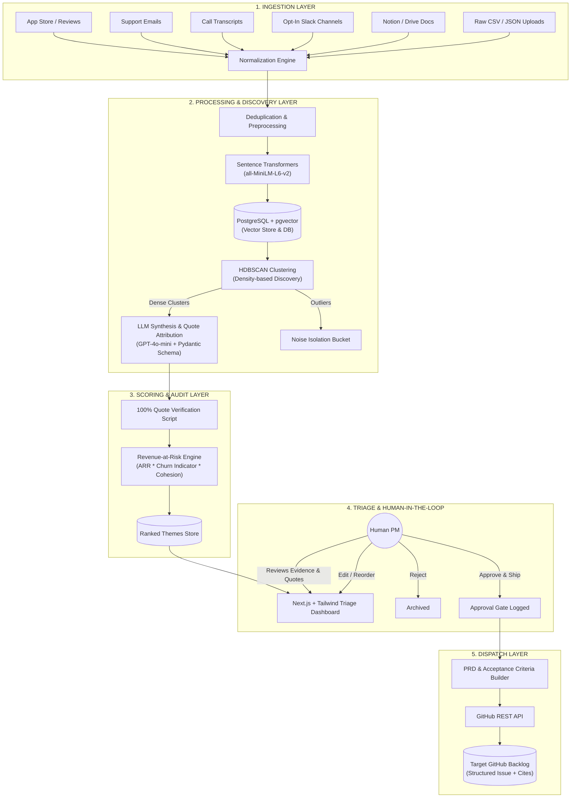

# System Architecture Document

## Project Name: **Motif**
> *Automated Feedback-to-Backlog Pipeline with Density Clustering and Revenue-at-Risk Prioritization*

---

## 1. System Overview & Architecture Diagram

Motif is architected as an asynchronous, multi-stage processing pipeline that converts unstructured user communications into structured, evidence-backed GitHub backlog issues.



---

## 2. End-to-End Pipeline Stages

### Stage 1: Ingestion & Privacy Boundary
- Connectors pull raw records via REST webhooks, scheduled polling, or file uploads.
- **Privacy Boundary:** Whitelist filter enforces opt-in scope. Personal DMs, private channels, and unselected directories are discarded at the boundary before persistence.
- Connector normalizes source records into standard `RawFeedback` objects.

### Stage 2: Normalization, Deduplication & Embedding
- Text cleaning, stripping markup/signatures, and extracting metadata (customer ID, tier, ARR, timestamp).
- Exact and near-duplicate matching (MinHash/LSH or cosine similarity $\ge 0.96$) to avoid skewing cluster sizes.
- Dense semantic vector generation using `sentence-transformers/all-MiniLM-L6-v2` (384-dimensional output).
- Ingestion into PostgreSQL with `pgvector` index (`HNSW` or `IVFFlat`).

### Stage 3: Unsupervised Theme Discovery (HDBSCAN)
- Dimensionality reduction / direct density clustering using `HDBSCAN` (via `scikit-learn` / `hdbscan`).
- Clusters form organically based on local density without pre-defining the number of clusters ($k$).
- Sparse data points are flagged with cluster label `-1` (Noise) and isolated.

### Stage 4: Grounded LLM Labeling & Quote Verification
- For each cluster, the top representative samples (closest to cluster medoid) are passed to `GPT-4o-mini`.
- A strict Pydantic JSON schema enforces:
  - Theme Title
  - Problem Summary
  - Affected User Workflows
  - **Explicit Source Quotes:** The LLM must extract exact sub-strings present in the source feedback items.
- **Verification Gate:** A deterministic string-matching validator checks that every generated citation exists verbatim in the database. Hallucinations trigger automatic prompt retry or rejection.

### Stage 5: Revenue-at-Risk Scoring
- Calculates financial exposure for each discovered theme:
  $$\text{Theme Score} = \sum_{i \in \text{Theme}} \left( \text{ARR}_i \times \text{Urgency Weight}_i \right) \times \text{Density Score}$$
- Emphasizes enterprise churn risk over pure complaint volume.

### Stage 6: Human PM Approval Gate
- Next.js UI displays the ranked list of candidate themes.
- PM can inspect every constituent quote, customer metadata, and ARR at stake.
- PM edits title/description or clicks **"Approve & Ship"**.

### Stage 7: Backlog Dispatching
- Compiles an engineering-ready PRD with Gherkin-formatted acceptance criteria.
- Dispatches payload to GitHub REST API (`POST /repos/{owner}/{repo}/issues`).

---

## 3. Technology Stack Specification

| Component | Technology | Rationale & Selection Criteria |
| :--- | :--- | :--- |
| **Backend Framework** | **Python 3.11+ / FastAPI** | High-performance asynchronous REST API, native Pydantic validation, tight integration with scientific Python libraries. |
| **Primary Database & Vector Search** | **PostgreSQL 16 + pgvector** | Single unified datastore for relational feedback metadata and high-dimensional semantic search; eliminates dual-store synchronization lag. |
| **Embedding Model** | **all-MiniLM-L6-v2** | 384-dimensional, blazingly fast inference ($< 5\text{ms}$ per item on CPU), low memory footprint, high clustering fidelity for feedback. |
| **Clustering Algorithm** | **HDBSCAN (scikit-learn)** | Density-based, automatically discovers cluster count, isolates noise points without forcing square pegs into round holes. |
| **LLM Inference** | **OpenAI GPT-4o-mini** | Low cost, low latency ($< 1.5\text{s}$ per cluster), high compliance with strict JSON schema outputs. |
| **Validation & Schema** | **Pydantic v2 / JSON Schema** | Strict runtime type enforcement, preventing malformed LLM responses from reaching the database. |
| **Frontend Framework** | **Next.js 14 (App Router) + TypeScript** | Server-side rendering, instant reactive updates, professional component architecture. |
| **Styling** | **Tailwind CSS** | Dense, utilitarian design system tailored for high-speed triage workflows. |
| **Containerization** | **Docker & Docker Compose** | Reproducible multi-container stack (FastAPI backend, Next.js frontend, PostgreSQL+pgvector). |
| **Target Integration** | **GitHub REST API (v3)** | Standardized issue generation with labels, milestones, and markdown PRDs. |

---

## 4. Repository & Monorepo Directory Structure

```text
motif/
├── docker-compose.yml
├── .env.example
├── .gitignore
├── README.md
├── PRD.md
├── Architecture.md
├── Rules.md
├── Phases.md
├── Design.md
├── Memory.md
│
├── backend/
│   ├── Dockerfile
│   ├── pyproject.toml
│   ├── requirements.txt
│   ├── alembic/
│   │   ├── env.py
│   │   └── versions/
│   ├── app/
│   │   ├── __init__.py
│   │   ├── main.py
│   │   ├── config.py
│   │   │
│   │   ├── api/
│   │   │   ├── __init__.py
│   │   │   ├── deps.py
│   │   │   ├── v1/
│   │   │   │   ├── __init__.py
│   │   │   │   ├── router.py
│   │   │   │   ├── endpoints/
│   │   │   │   │   ├── feedback.py
│   │   │   │   │   ├── pipeline.py
│   │   │   │   │   ├── themes.py
│   │   │   │   │   └── github.py
│   │   │
│   │   ├── connectors/
│   │   │   ├── __init__.py
│   │   │   ├── base.py
│   │   │   ├── app_store.py
│   │   │   ├── email_support.py
│   │   │   ├── transcripts.py
│   │   │   ├── slack.py
│   │   │   └── file_upload.py
│   │   │
│   │   ├── core/
│   │   │   ├── __init__.py
│   │   │   ├── embeddings.py
│   │   │   ├── clustering.py
│   │   │   ├── ranker.py
│   │   │   ├── llm_labeler.py
│   │   │   ├── citation_verifier.py
│   │   │   └── prd_generator.py
│   │   │
│   │   ├── db/
│   │   │   ├── __init__.py
│   │   │   ├── session.py
│   │   │   └── base.py
│   │   │
│   │   ├── models/
│   │   │   ├── __init__.py
│   │   │   ├── feedback.py
│   │   │   ├── cluster.py
│   │   │   ├── theme.py
│   │   │   └── audit.py
│   │   │
│   │   ├── schemas/
│   │   │   ├── __init__.py
│   │   │   ├── feedback.py
│   │   │   ├── theme.py
│   │   │   ├── llm_response.py
│   │   │   └── github.py
│   │   │
│   │   └── tests/
│   │       ├── test_connectors.py
│   │       ├── test_clustering.py
│   │       ├── test_citation_verifier.py
│   │       └── test_pipeline.py
│
├── frontend/
│   ├── Dockerfile
│   ├── package.json
│   ├── tsconfig.json
│   ├── next.config.js
│   ├── tailwind.config.ts
│   ├── postcss.config.js
│   │
│   └── src/
│       ├── app/
│       │   ├── layout.tsx
│       │   ├── page.tsx
│       │   ├── triage/
│       │   │   └── page.tsx
│       │   ├── themes/
│       │   │   └── [id]/page.tsx
│       │   └── settings/
│       │       └── page.tsx
│       │
│       ├── components/
│       │   ├── layout/
│       │   │   ├── Navbar.tsx
│       │   │   └── Sidebar.tsx
│       │   ├── triage/
│       │   │   ├── ThemeCard.tsx
│       │   │   ├── RevenueRiskBadge.tsx
│       │   │   ├── QuoteInspector.tsx
│       │   │   ├── PrdPreviewModal.tsx
│       │   │   └── ApprovalActionPanel.tsx
│       │   └── ui/
│       │       ├── Button.tsx
│       │       ├── Badge.tsx
│       │       ├── Modal.tsx
│       │       └── MetricCard.tsx
│       │
│       ├── lib/
│       │   ├── api.ts
│       │   ├── types.ts
│       │   └── utils.ts
│       │
│       └── hooks/
│           ├── useThemes.ts
│           └── usePipelineStatus.ts
│
└── data/
    └── seed/
        ├── corpus_300.json
        ├── ground_truth_themes.json
        └── dedupe_benchmark.json
```

---

## 5. Core Data Models (Postgres & Pydantic)

### 5.1 Relational Database Schema (SQL / SQLAlchemy)
```sql
CREATE EXTENSION IF NOT EXISTS vector;

-- Raw and normalized feedback entries
CREATE TABLE feedback_items (
    id UUID PRIMARY KEY DEFAULT gen_random_uuid(),
    source_type VARCHAR(50) NOT NULL, -- 'app_store', 'email', 'transcript', 'slack', 'notion'
    external_id VARCHAR(255),
    content TEXT NOT NULL,
    clean_content TEXT NOT NULL,
    customer_id VARCHAR(255),
    customer_tier VARCHAR(50) DEFAULT 'free', -- 'enterprise', 'growth', 'starter', 'free'
    arr_value NUMERIC(12, 2) DEFAULT 0.00,
    churn_risk_flag BOOLEAN DEFAULT FALSE,
    embedding vector(384),
    created_at TIMESTAMP WITH TIME ZONE DEFAULT NOW(),
    metadata JSONB DEFAULT '{}'::jsonb
);

-- Discovered themes from clustering
CREATE TABLE themes (
    id UUID PRIMARY KEY DEFAULT gen_random_uuid(),
    cluster_id INT NOT NULL,
    title VARCHAR(255) NOT NULL,
    summary TEXT NOT NULL,
    revenue_at_risk NUMERIC(12, 2) DEFAULT 0.00,
    affected_accounts_count INT DEFAULT 0,
    status VARCHAR(50) DEFAULT 'pending_review', -- 'pending_review', 'approved', 'rejected', 'shipped'
    prd_markdown TEXT,
    github_issue_url VARCHAR(500),
    github_issue_number INT,
    created_at TIMESTAMP WITH TIME ZONE DEFAULT NOW(),
    updated_at TIMESTAMP WITH TIME ZONE DEFAULT NOW()
);

-- Association between feedback items and discovered themes
CREATE TABLE theme_feedback_associations (
    theme_id UUID REFERENCES themes(id) ON DELETE CASCADE,
    feedback_item_id UUID REFERENCES feedback_items(id) ON DELETE CASCADE,
    is_cited_quote BOOLEAN DEFAULT FALSE,
    quote_text TEXT,
    PRIMARY KEY (theme_id, feedback_item_id)
);

-- Audit log for human PM actions
CREATE TABLE approval_audit_log (
    id UUID PRIMARY KEY DEFAULT gen_random_uuid(),
    theme_id UUID REFERENCES themes(id),
    pm_user_id VARCHAR(255) NOT NULL,
    action VARCHAR(50) NOT NULL, -- 'approved', 'edited', 'rejected'
    original_title VARCHAR(255),
    final_title VARCHAR(255),
    timestamp TIMESTAMP WITH TIME ZONE DEFAULT NOW()
);
```

---

## 6. Primary API Endpoints (FastAPI Backend)

| Method | Endpoint | Description |
| :--- | :--- | :--- |
| `POST` | `/api/v1/feedback/ingest` | Ingests a batch of feedback items from a specific connector. |
| `POST` | `/api/v1/feedback/upload` | Uploads raw CSV or JSON file containing customer feedback. |
| `POST` | `/api/v1/pipeline/run` | Triggers the complete pipeline (dedupe $\rightarrow$ embed $\rightarrow$ HDBSCAN $\rightarrow$ LLM synthesis $\rightarrow$ ranking). |
| `GET` | `/api/v1/pipeline/status` | Returns real-time status, processing stage, and latency metrics. |
| `GET` | `/api/v1/themes` | Lists all discovered themes ordered by Revenue at Risk. |
| `GET` | `/api/v1/themes/{id}` | Returns theme details, constituent quotes, and linked raw feedback. |
| `PATCH`| `/api/v1/themes/{id}` | Allows PM to update title, summary, or priority adjustments. |
| `POST` | `/api/v1/themes/{id}/approve` | Approves theme, compiles PRD, and dispatches issue to GitHub. |
| `POST` | `/api/v1/themes/{id}/reject` | Marks theme as rejected and archives from active triage. |
| `GET` | `/api/v1/metrics/eval` | Evaluates $P@3$ and acceptance rate against the seeded benchmark dataset. |
