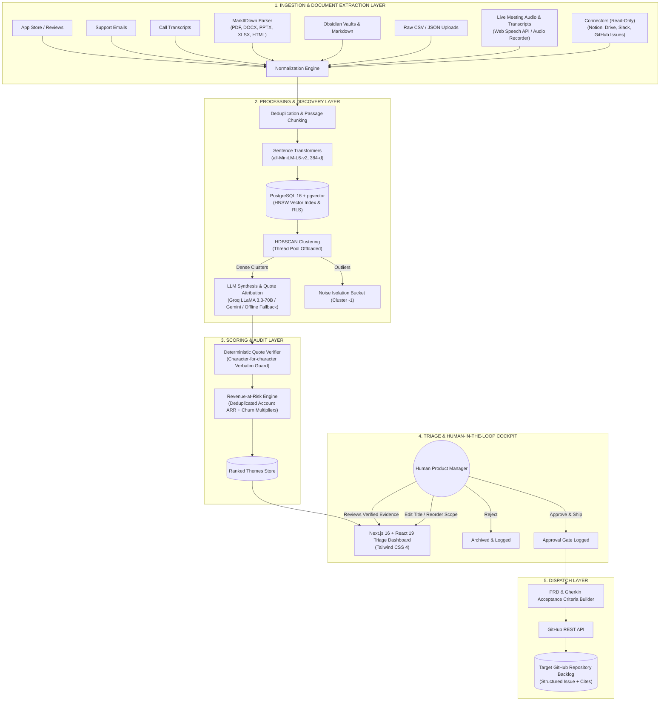
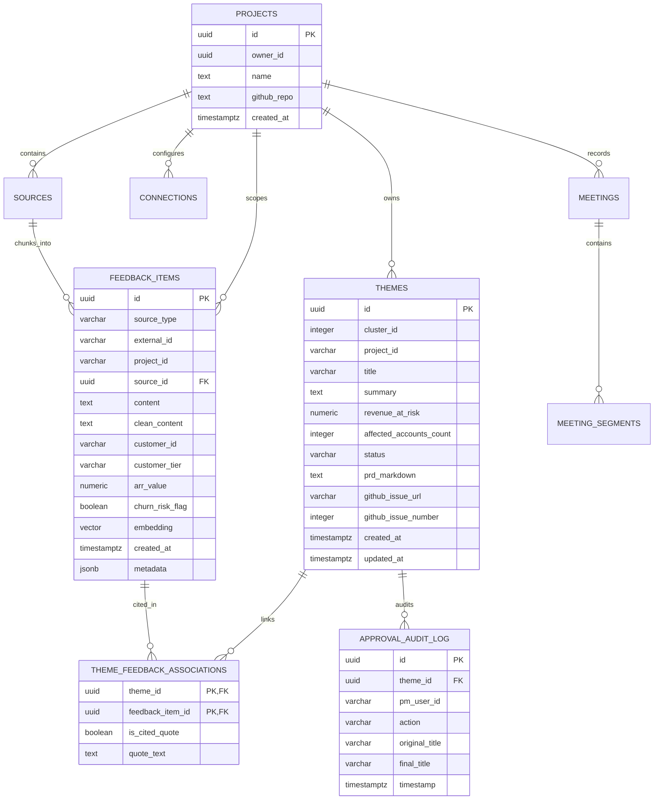

# System Architecture Document

## Project Name: **Motif**
> *Automated Feedback-to-Backlog Pipeline with Density Clustering, Revenue-at-Risk Prioritization, and Multi-Source Project Workspaces*

---

## 1. System Overview & Architecture Diagram

Motif is architected as an asynchronous, multi-stage processing pipeline that converts unstructured user communications and multi-modal documents into structured, evidence-backed GitHub backlog issues.



---

## 2. End-to-End Pipeline Stages

### Stage 1: Multi-Modal Ingestion & Privacy Boundary
- Connectors pull raw records via REST endpoints, multi-part file uploads, or read-only integrations.
- **MarkItDown Document Conversion:** Office documents (`.docx`, `.pptx`, `.xlsx`), PDFs, and HTML are converted to structured Markdown while preserving tables and outlines.
- **Privacy Boundary:** Whitelist filter enforces opt-in scope. Personal DMs, private channels, and unselected directories are discarded at the boundary before persistence.
- Connector normalizes source records into standard `FeedbackItem` objects and partitions them by `project_id`.

### Stage 2: Passage Chunking, Deduplication & Embedding
- Documents are split into coherent passages (~900 characters) matching speaker turns, paragraphs, or table rows.
- Duplicate detection via content hashes (`content_hash`) avoids re-importing unchanged files.
- Dense semantic vector generation using `sentence-transformers/all-MiniLM-L6-v2` (384-dimensional output).
- Ingestion into PostgreSQL with `pgvector` HNSW index (`vector_cosine_ops`) for sub-millisecond similarity retrieval.

### Stage 3: Unsupervised Theme Discovery (HDBSCAN)
- Dimensionality reduction and density clustering using `HDBSCAN` (via `scikit-learn`).
- Execution is offloaded to a thread pool executor (`asyncio.to_thread`) to ensure the FastAPI event loop remains non-blocking.
- Clusters form organically based on local density without pre-defining cluster counts ($k$).
- Sparse data points are flagged with cluster label `-1` (Noise) and isolated from synthesis.

### Stage 4: Grounded LLM Labeling & Quote Verification
- For each cluster, representative exemplar passages are passed to the LLM (default: **Groq LLaMA 3.3-70B** via `llama-3.3-70b-versatile`; Gemini 2.0 Flash and OpenAI GPT-4o-mini also supported).
- When no API key is supplied, Motif automatically engages its **Deterministic Offline Labeler**, extracting verbatim quotes via heuristic regex without external network calls.
- Strict Pydantic JSON schema enforces:
  - Theme Title
  - Problem Summary
  - Affected User Workflows
  - **Explicit Source Quotes:** Verbatim substrings present in the source feedback items.
- **Verification Gate:** A deterministic string-matching validator checks that every generated citation exists verbatim in the source text. Non-matching quotes are discarded.

### Stage 5: Revenue-at-Risk Scoring
- Calculates financial exposure for each discovered theme with **account deduplication**:
  $$\text{Revenue at Risk} = \sum_{a \in \text{Unique Accounts}} \text{ARR}_a \times \max_{i \in \text{Items}_a}(\text{Churn Multiplier}_i)$$
- Each distinct customer account's ARR is credited at most once per theme, ensuring that multiple tickets from one enterprise customer do not artificially multiply revenue numbers.
- Unpriced document uploads rank by passage mention density.

### Stage 6: Human PM Approval Gate
- Next.js triage cockpit displays ranked candidate themes.
- Product managers can inspect every constituent quote, source provenance document, customer tier, and ARR value.
- PM can edit the title, adjust scope, or click **"Approve & Ship"** (or **"Reject"**).

### Stage 7: Backlog Dispatching
- Compiles an engineering-ready PRD with user context and Gherkin-formatted acceptance criteria (`Given/When/Then`).
- Dispatches payload to GitHub REST API (`POST /repos/{owner}/{repo}/issues`).
- Generates issue number, labels (`motif-approved`, `revenue-risk`), and links back to the triage cockpit.

---

## 3. Technology Stack Specification

| Component | Technology | Rationale & Selection Criteria |
| :--- | :--- | :--- |
| **Backend Framework** | **Python 3.11+ / FastAPI** | High-performance asynchronous REST API, native Pydantic v2 validation, thread pool concurrency. |
| **Primary Database & Vector Search** | **PostgreSQL 16 + pgvector** | Unified relational and vector datastore with HNSW indexing and Row-Level Security (RLS). |
| **Embedding Model** | **all-MiniLM-L6-v2** | 384-dimensional, blazingly fast inference ($< 2\text{ms}$ per item on CPU), runs locally without API costs. |
| **Clustering Algorithm** | **HDBSCAN (scikit-learn)** | Unsupervised density-based discovery; rejects noise without forcing fixed cluster numbers. |
| **Primary LLM Inference** | **Groq LLaMA 3.3-70B** | Ultra-fast token throughput ($< 4\text{s}$ for full synthesis), 100% free-tier processing via Groq Cloud. |
| **Fallback LLMs** | **Gemini 2.0 Flash / OpenAI / Offline Labeler** | Resilient multi-provider support with deterministic offline fallback when no API key exists. |
| **Document Extraction** | **MarkItDown (Microsoft)** | Converts PDF, DOCX, PPTX, XLSX, and HTML into clean, semantically intact Markdown. |
| **Validation & Schema** | **Pydantic v2 / JSON Schema** | Strict runtime type enforcement, preventing malformed LLM responses from reaching storage. |
| **Frontend Framework** | **Next.js 16 (App Router) + React 19** | Modern server/client hybrid architecture, instant UI responsiveness, built-in API proxy rewrites. |
| **Styling** | **Tailwind CSS 4** | Ultra-dense operational cockpit styling with custom slate and ember tokens. |
| **Authentication** | **Supabase Auth / JWKS** | Optional JWT validation; multi-tenant project isolation via Supabase RLS. |
| **Target Integration** | **GitHub REST API (v3)** | Standardized issue generation with labels, milestones, and structured PRDs. |

---

## 4. Repository Directory Structure

```text
ASYNC-MOTIF/
├── docker-compose.yml              # Multi-container orchestration (Postgres, Backend, UI)
├── Dockerfile                      # Production backend container definition
├── alembic.ini                     # Alembic database migration config
├── pyproject.toml                  # Python packaging & tool configuration
├── requirements.txt                # Backend dependencies (FastAPI, pgvector, scikit-learn, etc.)
├── seed.py                         # Benchmark generator & PostgreSQL seeder (300 items)
├── .env.example                    # Environment variable specification matrix
├── README.md                       # ASYNC'26 Standardized Project README
├── Architecture.md                 # System architecture & component design
├── Design.md                       # Design system & triage cockpit specifications
├── PRD.md                          # Product requirements & user stories
├── Rules.md                        # Non-negotiable engineering axioms
├── Phases.md                       # Multi-phase roadmap and delivery audit
├── Memory.md                       # Living project context tracker
│
├── alembic/                        # Database migration scripts
│   ├── env.py
│   └── versions/
│       ├── 001_initial_schema.py    # feedback_items, themes, associations, audit
│       ├── 002_project_scoping.py   # project_id scoping columns & indexes
│       └── 003_sources_meetings.py  # projects, connections, sources, meetings, HNSW index
│
├── app/                            # FastAPI Application Package
│   ├── main.py                     # App lifespan, CORS, and router registration
│   ├── config.py                   # Centralized Pydantic settings & env management
│   │
│   ├── api/v1/                     # REST API v1 Endpoints
│   │   ├── router.py               # Combined API router with auth dependencies
│   │   └── endpoints/
│   │       ├── health.py           # Uptime & pgvector health checks
│   │       ├── projects.py         # Project workspace CRUD
│   │       ├── feedback.py         # Feedback ingestion and query
│   │       ├── sources.py          # File upload & document extraction
│   │       ├── connections.py      # Third-party read-only integrations
│   │       ├── pipeline.py         # Autonomous clustering & pipeline runner
│   │       ├── themes.py           # Theme querying, approval, and rejection
│   │       ├── metrics.py          # Live P@3, acceptance rate, and citation validity
│   │       └── members.py          # Project team collaboration
│   │
│   ├── core/                       # Core Pipeline Intelligence
│   │   ├── auth.py                 # Supabase JWT verification & auth bypass
│   │   ├── embeddings.py           # Sentence-transformers embedding wrapper
│   │   ├── clustering.py           # HDBSCAN clustering engine
│   │   ├── llm_labeler.py          # Groq / Gemini / OpenAI / Offline synthesis
│   │   ├── citation_verifier.py    # Deterministic verbatim quote validation
│   │   ├── scoring.py              # Deduplicated Revenue at Risk ranker
│   │   ├── extraction.py           # MarkItDown multi-format parser & chunker
│   │   ├── prd_generator.py        # Markdown PRD & Gherkin criteria compiler
│   │   ├── github_dispatcher.py    # GitHub REST issue creator
│   │   └── pipeline.py             # Orchestrator & SSE progress broadcaster
│   │
│   ├── db/                         # Database Access Layer
│   │   ├── base.py                 # SQLAlchemy declarative base
│   │   └── session.py              # Async SQLAlchemy session factory & health checks
│   │
│   ├── models/                     # SQLAlchemy ORM Models
│   │   ├── feedback.py             # FeedbackItem entity
│   │   ├── theme.py                # Theme, ThemeFeedbackAssociation entities
│   │   ├── project.py              # Project, Source, Connection entities
│   │   ├── meeting.py              # Meeting, MeetingSegment entities
│   │   └── audit.py                # ApprovalAuditLog entity
│   │
│   └── schemas/                    # Pydantic v2 Request/Response Schemas
│       ├── feedback.py
│       ├── theme.py
│       ├── project.py
│       ├── source.py
│       ├── connection.py
│       ├── llm_response.py
│       └── metrics.py
│
├── triage-ui/                      # Next.js 16 Frontend Application
│   ├── package.json
│   ├── next.config.ts              # API proxy rewrites to :8000 (10 min timeout)
│   ├── tsconfig.json
│   │
│   └── src/
│       ├── app/
│       │   ├── layout.tsx          # Root shell layout
│       │   ├── globals.css         # Tailwind CSS 4 theme imports
│       │   └── page.tsx            # Main Triage Cockpit (Projects, Themes, Live Audio)
│       │
│       ├── components/
│       │   ├── Connectors.tsx      # Integration connector modal
│       │   ├── ShareProject.tsx    # Team member invitation modal
│       │   └── ScoreBreakdown.tsx  # Interactive revenue calculation inspector
│       │
│       └── utils/
│           ├── api.ts              # Type-safe API client & pipeline poller
│           ├── supabase.ts         # Supabase client helper
│           └── types.ts            # Frontend TypeScript data interfaces
│
├── tests/                          # Automated Pytest Suite (15 Test Modules)
│   ├── conftest.py
│   ├── test_clustering_and_ai.py
│   ├── test_scoring.py
│   ├── test_scoring_db.py
│   ├── test_ingestion.py
│   ├── test_integrations.py
│   ├── test_auth.py
│   ├── test_connections_db.py
│   ├── test_pipeline_progress.py
│   └── test_health.py
│
├── scripts/                        # Database Bootstrapping Scripts
│   └── init-db.sql                 # PostgreSQL 16 schema + pgvector DDL
│
└── data/                           # Evaluation & Seed Benchmarks
    ├── seed/
    │   └── corpus_300.json         # 300 curated feedback items with ground-truth
    └── demo-sources/               # Multi-modal enterprise documents (Word, PDF, PPTX, etc.)
```

---

## 5. Core Data Models (Postgres & SQLAlchemy)

### Database Schema (ER Summary)



---

## 6. Key API Contracts

### Pipeline Trigger: `POST /api/v1/pipeline/run`
- **Request Body:**
  ```json
  {
    "batch_size": 100,
    "project_id": null
  }
  ```
- **Response:**
  ```json
  {
    "status": "running",
    "message": "Autonomous clustering and labeling pipeline initiated."
  }
  ```

### Theme Approval: `POST /api/v1/themes/{theme_id}/approve`
- **Request Body:**
  ```json
  {
    "pm_user_id": "pm_abhishek",
    "edited_title": "Resolved Google Workspace SSO Session Persistence",
    "generate_github_issue": true
  }
  ```
- **Response:**
  ```json
  {
    "status": "approved",
    "theme_id": "8f3e2a52-...",
    "github_issue_url": "https://github.com/owner/repo/issues/42",
    "github_issue_number": 42,
    "audit_log_id": "1b2c3d4e-..."
  }
  ```

### Live Evaluation Metrics: `GET /api/v1/metrics/eval`
- **Response:**
  ```json
  {
    "precision_at_3": 1.0,
    "pm_acceptance_rate": 0.85,
    "citation_validity": 1.0,
    "total_revenue_at_risk": 980000.0,
    "sample_size": 300
  }
  ```
