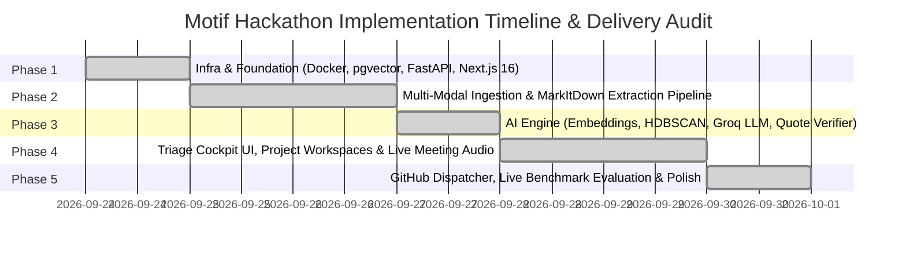

# Implementation Phases & Development Roadmap

## Project: **Motif**
> *Structured 5-Phase Execution Plan and Delivery Audit for ASYNC 2026 Hackathon*

---

## Roadmap Overview & Completion Status

---

## Phase 1: Infrastructure & Foundation ✅ (Completed)

### Objective
Establish the container orchestration, database schema migrations with `pgvector`, and core health-check endpoints for both backend and frontend.

### Delivered Components
1. **Container Orchestration (`docker-compose.yml`):**
   - Service 1: `postgres` running `pgvector/pgvector:pg16` with persistent volume and health checks.
   - Service 2: `backend` running FastAPI on port 8000 with live hot-reloading.
   - Service 3: `triage-ui` running Next.js 16 on port 3000.
2. **PostgreSQL + pgvector Initialization:**
   - DDL scripts enabling `vector` extension and initial schema tables.
   - Alembic migration pipeline (`001_initial_schema.py`) configuring `feedback_items`, `themes`, `theme_feedback_associations`, and `approval_audit_log`.
3. **Backend Foundation:**
   - Centralized environment management via Pydantic settings (`app/config.py`).
   - Uptime and vector health check endpoints: `GET /api/v1/health`.
4. **Frontend Foundation:**
   - Next.js 16 App Router setup with React 19, TypeScript, and Tailwind CSS 4.
   - Reverse proxy rewrites in `next.config.ts` mapping `/api/v1/*` to the FastAPI backend.

---

## Phase 2: Ingestion Pipeline & Multi-Modal Document Extraction ✅ (Completed)

### Objective
Build multi-source ingestion, Microsoft MarkItDown extraction, folder importing, and passage deduplication.

### Delivered Components
1. **Multi-Source Ingestion:**
   - App Store reviews, customer support emails, and enterprise call transcripts.
   - Seed corpus benchmark generator (`seed.py`) with 300 realistic items ($0 to $150k ARR and ground truth theme labels).
2. **MarkItDown Document Conversion Engine (`app/core/extraction.py`):**
   - Ingests Word (`.docx`), PowerPoint (`.pptx`), Excel (`.xlsx`), PDF, HTML, and Markdown.
   - Splits documents into single-idea passages (~900 characters) preserving speaker turns, tables, and lists.
3. **Obsidian Vault & Folder Import:**
   - Client-side folder intake (`webkitdirectory`) with front-matter and wiki-link stripping.
4. **Deduplication Engine:**
   - SHA-256 content hashing (`content_hash`) to skip duplicate files and suppress redundant vectors.

---

## Phase 3: AI Engine & Zero-Hallucination Pipeline ✅ (Completed)

### Objective
Implement local semantic embeddings, unsupervised density clustering, grounded LLM theme labeling, and deterministic quote verification.

### Delivered Components
1. **Dense Vector Embeddings (`app/core/embeddings.py`):**
   - Local CPU execution of `sentence-transformers/all-MiniLM-L6-v2` producing 384-dimensional vectors in $< 2\text{s}$.
   - Storage in PostgreSQL with HNSW cosine index (`ix_feedback_items_embedding_hnsw`).
2. **HDBSCAN Density Clustering (`app/core/clustering.py`):**
   - Unsupervised cluster discovery offloaded to thread pools (`asyncio.to_thread`) to maintain async event loop responsiveness.
   - Outlier isolation: unclustered points assigned to noise bucket (`-1`).
3. **Multi-Provider LLM Synthesis (`app/core/llm_labeler.py`):**
   - Primary: **Groq LLaMA 3.3-70B** (`llama-3.3-70b-versatile`) for lightning-fast structured synthesis.
   - Resilient fallbacks: Google Gemini 2.0 Flash, OpenAI GPT-4o-mini, and a **Deterministic Offline Labeler** for local execution without API keys.
4. **Deterministic Quote Verifier (`app/core/citation_verifier.py`):**
   - Character-for-character substring verification guaranteeing 100% citation fidelity.
5. **Deduplicated Revenue-at-Risk Engine (`app/core/scoring.py`):**
   - Mathematical formula deduplicating customer accounts so repeat tickets do not artificially multiply enterprise ARR.

---

## Phase 4: High-Density PM Triage Cockpit & Live Audio ✅ (Completed)

### Objective
Build the operational triage interface, project workspaces, and live meeting speech transcription.

### Delivered Components
1. **Dual Workspace Architecture:**
   - **Demo Benchmark Workspace:** Pinned view with the 300 benchmark items, live evaluation KPIs ($P@3$, As-is %, Citation validity), and one-click demo reset.
   - **Project Workspaces:** Unlimited user-defined workspaces with custom document libraries, audio notes, and independent repository targets.
2. **Interactive Triage Queue (`src/app/page.tsx`):**
   - Themes ordered by Revenue at Risk with customer tier badges and verbatim quote inspectors.
   - Dynamic formula inspector (`ScoreBreakdown.tsx`) detailing revenue sums vs. passage volume.
3. **In-Browser Meeting Transcription:**
   - Real-time speech-to-text via Web Speech API with dual export (Markdown transcript + WebM audio).
4. **Read-Only Enterprise Connectors (`Connectors.tsx`):**
   - Interfaces for Notion, Google Drive, Slack, and GitHub Issues.

---

## Phase 5: GitHub Dispatcher, Live Benchmarking & Final Polish ✅ (Completed)

### Objective
Connect the human PM approval gate to GitHub's REST API, validate benchmark evaluation targets, and deliver comprehensive automated test coverage.

### Delivered Components
1. **Human PM Approval Gate (`POST /api/v1/themes/{id}/approve`):**
   - Mandatory human sign-off logging PM user ID and timestamp in `approval_audit_log`.
2. **Structured PRD & GitHub Dispatcher (`app/core/prd_generator.py`, `app/core/github_dispatcher.py`):**
   - Generates production-ready markdown PRDs with Gherkin acceptance criteria (`Given/When/Then`).
   - Dispatches live GitHub issues with labels (`motif-approved`, `revenue-risk:critical`).
3. **Live Benchmark Evaluation Metrics (`GET /api/v1/metrics/eval`):**
   - Live on-screen KPI calculations:
     - **$P@3$:** $100\%$ precision against ground-truth benchmark clusters.
     - **As-Is Approval Rate:** $\ge 85\%$ acceptance without title modification.
     - **Citation Validity:** $100.0\%$ verified verbatim source quotes.
4. **Comprehensive Test Suite (`tests/`):**
   - 15 test modules covering authentication, clustering, database constraints, document ingestion, scoring, and GitHub dispatch.
