# Implementation Phases & Development Roadmap

## Project: **Motif**
> *Structured 5-Phase Execution Plan for ASYNC 2026 Hackathon*

---

## Roadmap Overview

```mermaid
gantt
    title Motif Hackathon Implementation Timeline
    dateFormat  X
    axisFormat  Day %d
    section Phase 1
    Infra & Monorepo Setup (Docker, DB, FastAPI, Next.js) :active, p1, 0, 1
    section Phase 2
    Ingestion Connectors & Normalization Pipeline        :p2, 1, 2
    section Phase 3
    AI Engine (Embeddings, HDBSCAN, LLM Labeler, Scorer) :p3, 2, 3
    section Phase 4
    Triage Cockpit UI & Human-in-the-Loop Approval Gate  :p4, 3, 4
    section Phase 5
    GitHub Integration, Benchmarking & Live Demo Polish  :p5, 4, 5
```

---

## Phase 1: Infrastructure & Monorepo Foundation

### Objective
Establish the foundational local development environment, container orchestration, database schema migrations, and core health-check endpoints for both backend and frontend.

### Deliverables
1. **Container Orchestration (`docker-compose.yml`):**
   - Service 1: `postgres` with `pgvector/pgvector:pg16` extension pre-enabled.
   - Service 2: `backend` running FastAPI with live hot-reloading (`uvicorn --reload`).
   - Service 3: `frontend` running Next.js 14 development server (`npm run dev`).
2. **PostgreSQL + pgvector Initialization:**
   - Database initialization script enabling `vector` extension.
   - Initial Alembic migration defining `feedback_items`, `themes`, `theme_feedback_associations`, and `approval_audit_log`.
3. **Backend Skeleton:**
   - FastAPI application instance with CORS middleware, centralized config via `pydantic-settings`, and structured logging.
   - Healthcheck endpoint: `GET /api/v1/health` returning database and pgvector connection status.
4. **Frontend Skeleton:**
   - Next.js 14 App Router project setup with TypeScript, Tailwind CSS, Lucide icons, and base layout shell.
   - API client module (`lib/api.ts`) configured to communicate with the backend.

### Exit & Verification Criteria
- [ ] `docker compose up -d` boots all 3 containers cleanly without errors.
- [ ] Direct database query executes `SELECT '[1,2,3]'::vector;` successfully.
- [ ] Frontend successfully renders at `http://localhost:3000` and displays backend health status.

---

## Phase 2: Ingestion Pipeline & Connectors (3 MVP Sources)

### Objective
Build the multi-source ingestion layer, connector interface, data normalization engine, and deduplication mechanism.

### Deliverables
1. **Base Connector Interface (`connectors/base.py`):**
   - Abstract `BaseConnector` class defining standard ingestion signature:
     `async def fetch_and_normalize() -> List[RawFeedbackItem]`
2. **Three Core MVP Connectors:**
   - `AppStoreConnector` / `ReviewConnector`: Ingests public app reviews with star ratings, text, and user metadata.
   - `EmailSupportConnector`: Ingests customer support email threads with subject, sender email, customer tier, and body.
   - `TranscriptConnector`: Ingests sales/CS call transcripts parsed into timestamped speaker turns with ARR metadata.
   - *Stretch:* `SlackConnector`: Opt-in channel listener with privacy filter.
3. **File Upload Endpoint (`POST /api/v1/feedback/upload`):**
   - Supports uploading raw CSV/JSON feedback datasets directly into the database.
4. **Deduplication Engine:**
   - Lexical fingerprinting (MD5/SHA256 of normalized text) and near-duplicate cosine similarity filtering ($\ge 0.96$).
5. **Seeded Demo Corpus (`data/seed/corpus_300.json`):**
   - 300 curated feedback items with synthetic account metadata (ARR from $0 to $150k, customer tiers, and realistic churn indicators).

### Exit & Verification Criteria
- [ ] Ingesting `corpus_300.json` seeds all 300 records into `feedback_items`.
- [ ] Deduplication script successfully merges intentional duplicates from the benchmark test set.
- [ ] Privacy filter verifies zero private messages or excluded fields are stored.

---

## Phase 3: AI Engine (Embeddings, HDBSCAN, LLM Grounding, & Scorer)

### Objective
Implement the semantic discovery pipeline: vector embedding, density clustering, zero-hallucination LLM theme labeling with strict quote verification, and Revenue-at-Risk calculation.

### Deliverables
1. **Dense Vector Embeddings (`core/embeddings.py`):**
   - Batched inference using `sentence-transformers/all-MiniLM-L6-v2`.
   - Store 384-dimensional vectors directly into PostgreSQL `vector(384)` column.
2. **Density Clustering (`core/clustering.py`):**
   - Scikit-learn `HDBSCAN` integration with configurable `min_cluster_size` and `min_samples`.
   - Automatic separation of dense clusters from label `-1` (Noise).
3. **Structured LLM Labeler (`core/llm_labeler.py`):**
   - OpenAI `GPT-4o-mini` prompt with Pydantic JSON Schema enforcement.
   - Extracts: `title`, `problem_statement`, `affected_workflows`, and `cited_quotes`.
4. **Deterministic Quote Verifier (`core/citation_verifier.py`):**
   - Substring matcher verifying 100% of LLM-generated quotes match the source feedback items.
   - Rejection/retry loop if any hallucinated quote is detected.
5. **Revenue-at-Risk Engine (`core/ranker.py`):**
   - Computes weighted financial impact based on account ARR and churn intent keywords ("cancel", "unusable", "leaving", "alternative").
   - Sorts candidate themes in descending order of financial risk.

### Exit & Verification Criteria
- [ ] Pipeline executes 300 items end-to-end in $< 90\text{ seconds}$.
- [ ] HDBSCAN produces coherent clusters without artificial category buckets.
- [ ] 100% of generated theme citations pass the deterministic verification test.
- [ ] Enterprise churn threats rank above high-volume free-tier complaints.

---

## Phase 4: PM Triage Cockpit UI

### Objective
Create a high-density, professional triage dashboard for product managers to review, verify, edit, and approve candidate themes.

### Deliverables
1. **Triage Queue Dashboard (`src/app/triage/page.tsx`):**
   - Interactive list of discovered themes sorted by Revenue at Risk.
   - Prominent metric badges: Total Revenue at Risk, Affected Accounts Count, and Cluster Cohesion Score.
2. **Evidence & Quote Inspector (`components/triage/QuoteInspector.tsx`):**
   - Side-by-side view showing the synthesized problem alongside verbatim customer quotes.
   - Account metadata pill display (e.g., `Acme Corp | $120k ARR | Enterprise`).
   - Visual highlighting indicating exact quote verification confirmation.
3. **Interactive PM Controls:**
   - Inline title and problem statement editing.
   - Instant "Reject / Archive" action.
   - High-trust primary action: **"Approve & Ship"**.
4. **Live Benchmark Monitor:**
   - Real-time on-screen counter showing current $P@3$ precision score against ground truth and the share of tickets approved unedited.

### Exit & Verification Criteria
- [ ] UI loads 300-item clustered themes with $< 200\text{ms}$ render time.
- [ ] PM can click any quote to inspect original raw context and account metadata.
- [ ] Edits made by the PM persist seamlessly to the backend audit log.

---

## Phase 5: GitHub Dispatcher, Benchmarking & Live Demo Polish

### Objective
Complete the pipeline by auto-generating complete PRDs and filing actionable GitHub issues, followed by rigorous benchmark validation for live demo-day presentation.

### Deliverables
1. **Automated PRD Generator (`core/prd_generator.py`):**
   - Converts approved theme into a complete markdown PRD with context, user evidence, revenue risk, technical considerations, and Gherkin acceptance criteria (`Given / When / Then`).
2. **GitHub REST API Dispatcher (`api/v1/endpoints/github.py`):**
   - Submits structured issue to target repository via GitHub API (`POST /repos/{owner}/{repo}/issues`).
   - Tags with labels (`motif-approved`, `revenue-risk`, `theme`) and returns live issue URL.
3. **Seed Evaluation Benchmark Suite (`data/seed/`):**
   - Ground-truth evaluation script validating:
     - **$P@3 \ge 90\%$**
     - **End-to-end latency $< 90\text{ seconds}$**
     - **Citation validity $= 100\%$**
4. **Demo-Day Presentation Package:**
   - Seed script that ingests an unseen 300-item review set live on stage.
   - Live approval of theme #1 and instant demonstration of the created GitHub issue.

### Exit & Verification Criteria
- [ ] Clicking "Approve & Ship" in UI creates a real GitHub issue in $< 3\text{ seconds}$.
- [ ] Created GitHub issue contains complete PRD, acceptance criteria, and exact customer quote citations.
- [ ] End-to-end live demo runs without manual intervention in under 90 seconds.
